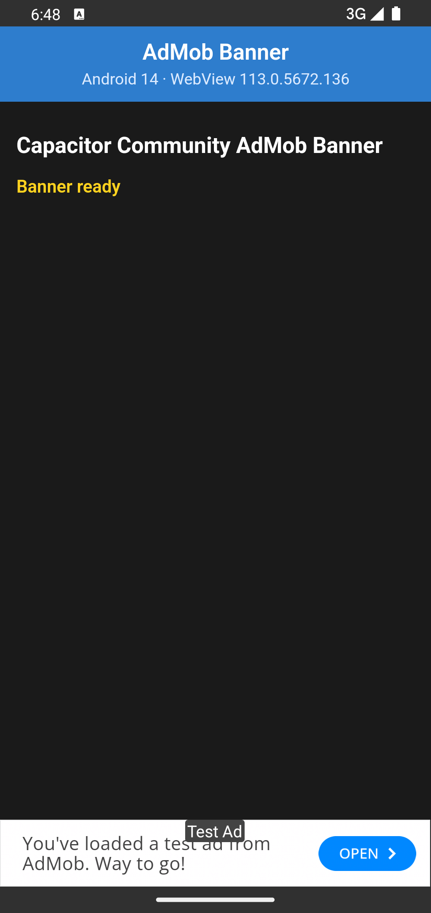
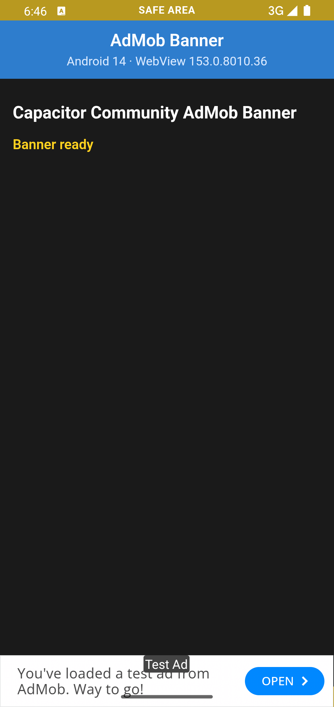
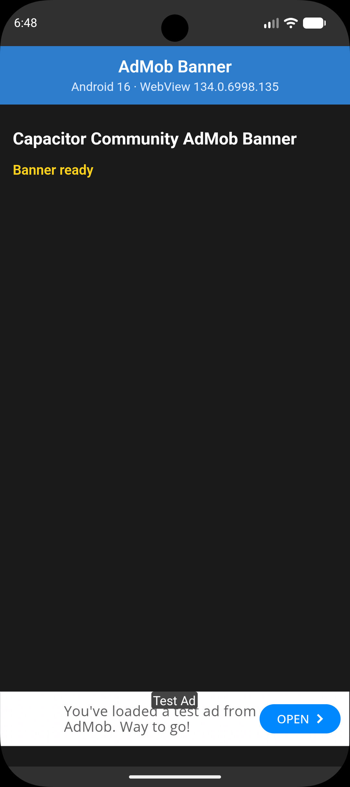
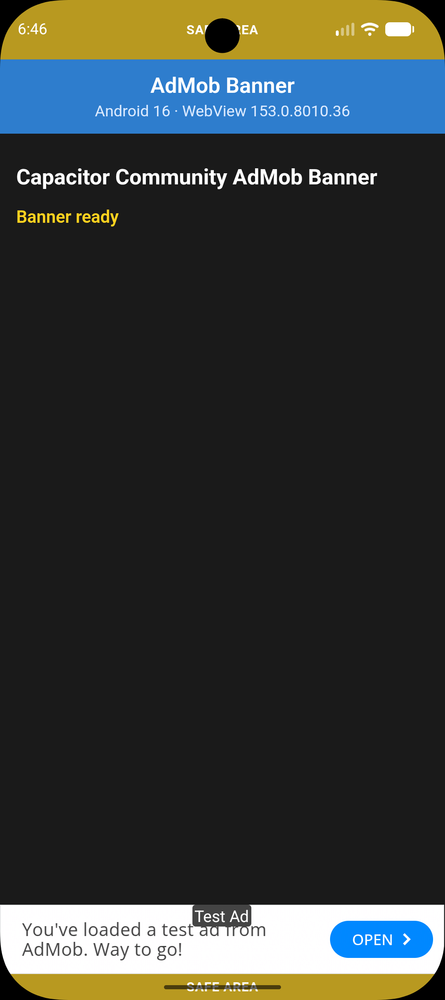

# AdMob Safe Area Reproduction

Minimal reproduction project for an Android safe-area issue with `@capacitor-community/admob` when using Capacitor 8.5.2+ and different Android System WebView versions.

## Observed behavior

| Android | WebView | Result | Screenshot |
|---|---|---|---|
| Android <= 14 | WebView < 140 | Works |  |
| Android <= 14 | WebView >= 140 | Banner is behind the navigation bar |  |
| Android >= 15 | WebView < 140 | Double safe-area padding |  |
| Android >= 15 | WebView >= 140 | Works |  |

The project uses an adaptive banner positioned at the bottom center.

## Reproduction

Install dependencies:

```bash
pnpm install
```

Then run the project:

```bash
pnpm start
```

Then test using different Android System WebView versions.

## Related Capacitor changes

- https://github.com/ionic-team/capacitor/pull/8535
- https://github.com/ionic-team/capacitor/pull/8599
- https://github.com/ionic-team/capacitor/pull/8604
